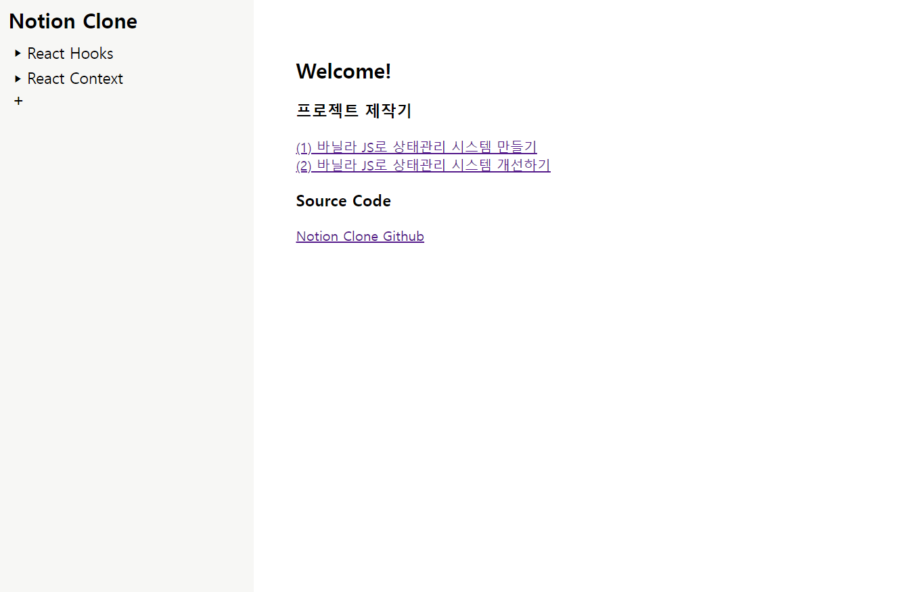

## Introduction

바닐라 자바스크립트로 구현한 노션 클로닝 프로젝트입니다.


기능은 사실 단순합니다

- 사이드 바를 통해 문서를 생성하고, 문서를 클릭하면 해당 문서의 내용을 볼 수 있습니다
- 각 문서의 내용은 일정 시간이 지나면 자동으로 저장됩니다.

모든 기능은 1주일 정도에 걸려 완성되었습니다.

하지만 그 이후로 구조에 대한 고민과 개선이 있었고,
그 과정에서 상태관리 방식의 변경, 라우팅 방식의 변경 등의 과정이 있었습니다.
그러한 개선을 통해 총 2달이 넘는 기간이 소모되었습니다.

아직 개선할 부분이 많고 구조적으로 고민해야 할 지점이 분명히 존재합니다.
이 프로젝트는 계속해서 구조적인 개선을 주안점으로 두고 개선해 나갈 예정입니다.

## Stack

JavaScript, HTML, CSS, webpack

## Start

배포 주소
https://notion-clone-phi-eight.vercel.app/

로컬에서 실행 할 경우

```
npm install
npm run dev
```

## Frontend

이 프로젝트는 1인 개발로, 제가 모두 직접 개발하였습니다.

## Backend

※관련 API는 모두 프로그래머스 측에서 제공받고 있습니다.
